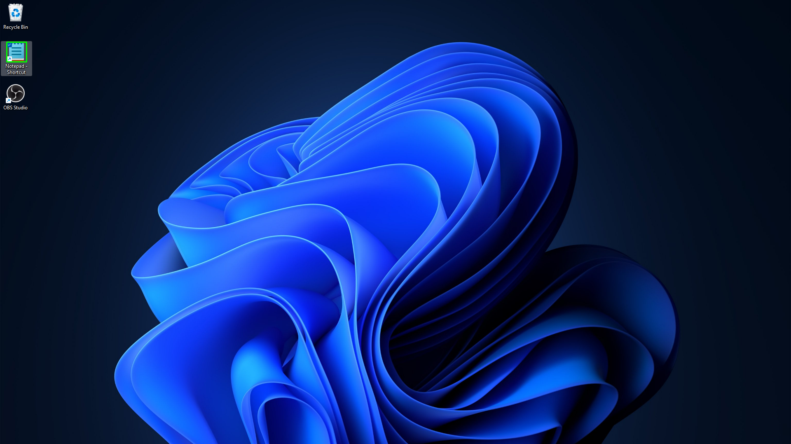
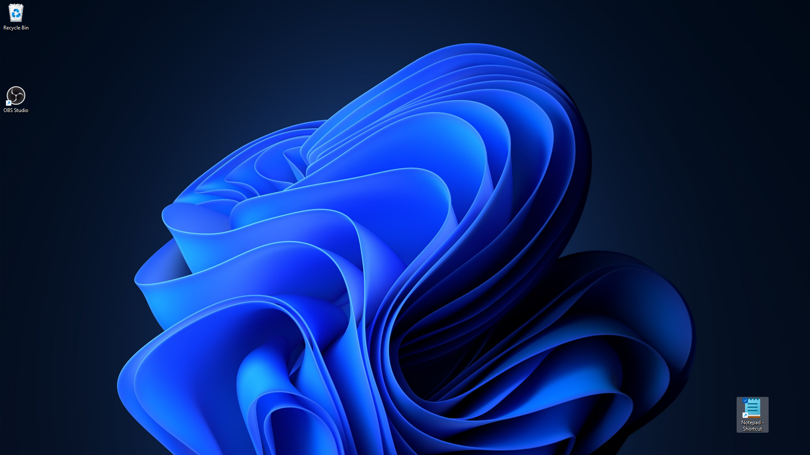
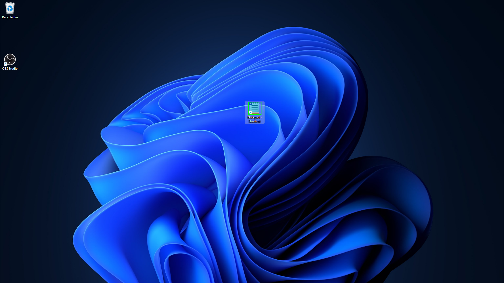
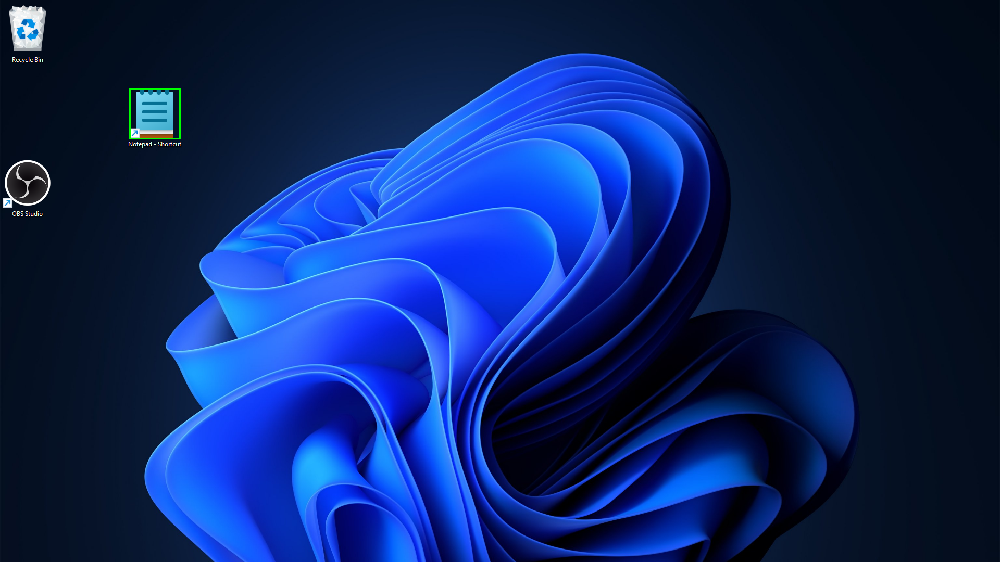
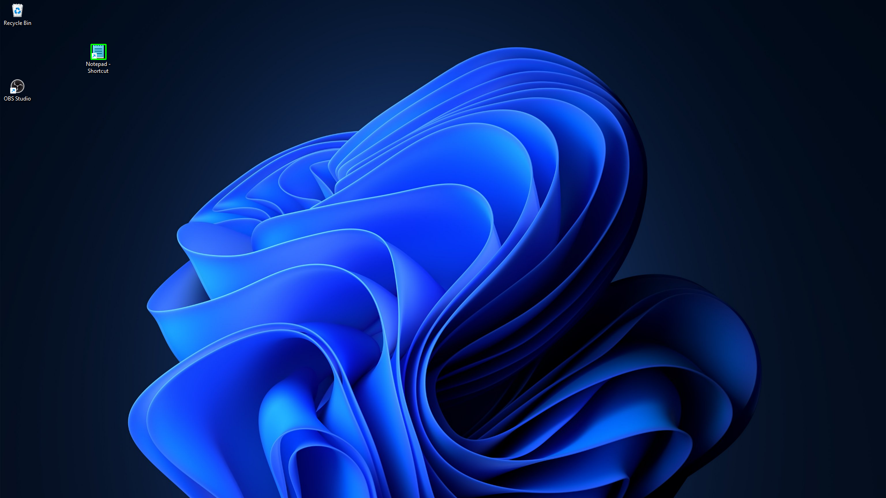

# autopad

**autopad** is a robust Python automation tool designed to programmatically control Windows Notepad. It bridges the gap between legacy automation and modern Windows 11 UI patterns, capable of handling text injection, file saving, and intelligent tab management.

It utilizes a hybrid approach, combining **UIA (User Interface Automation)** for reliable control interaction and **Computer Vision** for visual element detection.

## 🚀 Features

* **Hybrid Automation:**
    * **UIA Backend:** Uses `pywinauto` to interact with menus, dialogs, and text controls.
    * **Computer Vision:** Uses image recognition (in `vision/find.py`) to detect specific UI states or icons when standard handles are unavailable.
* **Dynamic Content:** Fetches post content via `api/posts.py` (or local JSON) to automate writing tasks.
* **Modern Dependency Management:** Built using `uv` for fast and reliable package management.

## 🛠️ Prerequisites

* **OS:** Windows 10 or Windows 11
* **Python:** 3.10+
* **Package Manager:** [uv](https://github.com/astral-sh/uv)

## 📥 Installation

1.  **Clone the repository**
    ```bash
    git clone --depth 1 --single-branch --branch master https://github.com/hsamn/autopad.git
    cd autopad
    ```

2.  **Install dependencies**
    Autopad uses `uv` to manage dependencies and lockfiles.
    ```bash
    uv sync
    ```

## ▶️ Usage

To start the automation script, use the standard entry point via `uv`:

```bash
uv run python -m autopad.main
```

## 🧪 Tests

### Top Left Medium



### Bottom Right Medium



### Center Medium



### Large



### Small



## 📁 Project Structure

```
autopad/
├── autopad/
│   ├── api/           # Logic for fetching content/posts
│   ├── assets/        # Visual templates for Computer Vision detection
│   ├── uia/           # Notepad-specific UIA control logic
│   ├── vision/        # Image recognition scripts
│   ├── utils/         # Helpers (logger, etc.)
│   ├── config.py      # Paths, timeouts, and global settings
│   └── main.py        # Main entry point
├── icons/             # Multi-resolution icon assets (new vs. old link styles)
├── pyproject.toml     # Project metadata and dependencies
└── uv.lock            # Locked dependency versions
```

## 📚 Dependencies

| Package |
|---------|
| `opencv-python-headless`|
| `numpy` |
| `pyautogui` |
| `mss` |
| `pywinauto` |
| `requests` |

## 📄 License

This project is licensed under the GNU General Public License v3.0 (GPLv3). See the LICENSE file for full details.
